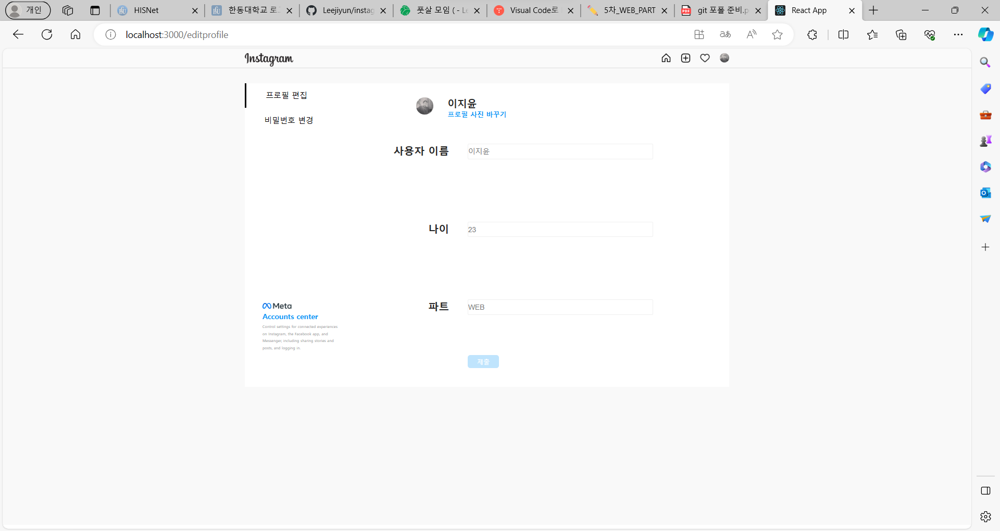

# Instagram Clone-Coding

## 5th homework
- Axios활용해서 서버와 데이터 주고 받기
  - get 요청을 활용해서 서버로부터 데이터 내려받기
  - patch 요청을 활용해서 새로운 정보 서버로 업데이트 하기
  - 이미지 post요청을 활용해서 URL생성하기

  - 프로필 사진 바꾸기를 누르면 사진을 변경할 수 있음
    - 사진이 변경되면 자동으로 post요청이 실행되어 imgURL을 얻음
  - 이름은 변경되지 않음- 데이터를 구별하는 값이기 때문
  - 나이와 파트에 다른 내용을 기입 후 제출 버튼을 누르면 imgURL과 함께 서버로 업데이트 되고 변경된 값들이 페이지(editprofile뿐만 아니라 외부 페이지에도)에 적용됨

